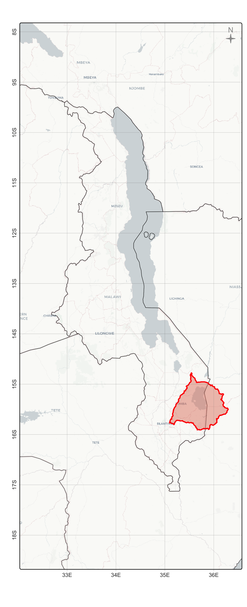

# Mapping Templates: Topo, Hydro, Landcover, Population, Locator Maps'
####### Murphy, S.; date: "2024-09-16"


## Load AOI & Borders

Derive `aoi` & `bbox` from site polygons & national datasets


``` r
aoi_site   = sf::read_sf("./inputs/chilwa_watershed_4326.shp")
aoi_malawi = giscoR::gisco_get_countries(country = "Malawi", resolution = "3")
aoi_region = giscoR::gisco_get_countries(
  country = c("Malawi", "Zambia", "Tanzania", "Mozambique"), resolution = "3"
  )

bbox_site  = terrainr::add_bbox_buffer(aoi_site, 20000, "meters")
vbox_malawi = terra::vect(terra::ext(vect(aoi_malawi)) * 1.4) 
crs(vbox_malawi) = "epsg:4326"
bbox_malawi = st_bbox(vbox_malawi)
```

## Site Map

We source higher-res basemaps from `maptiles` using `get_tiles` functions


``` r
# 'zoom' = 12 scales to 1:70,000 (https://wiki.openstreetmap.org/wiki/Zoom_levels)
basemap_150k = maptiles::get_tiles(
  bbox_site, 
  zoom      = 12, 
  crop      = T,
  provider  = "OpenTopoMap"
)

tmap::tm_shape(basemap_150k) + tm_rgb() + 
  tmap::tm_shape(aoi_site) +
  tmap::tm_borders(lwd = 1, col = "red") +
  tmap::tm_graticules(lines=T,labels.rot=c(0,90),lwd=0.2) +
  tmap::tm_credits("EPSG:4326", position = c("left", "bottom")) + 
  tmap::tm_scalebar(c(0, 10, 20, 40), position = c("right", "bottom"), text.size = .5) +
  tmap::tm_compass(
    type = "4star", size = 1.5,
    color.dark = "gray60", text.color = "gray60",
    position = c("left", "top")
    ) -> map_locator_site
map_locator_site

# width & height controls resolution of output, dpi affects 'attributes' sizes
tmap::tmap_save(
  map_locator_site, "./outputs/map_locator_site.png", 
  width=15120, height=15120, asp=0, dpi=2400
  )
```


## Locator Map


``` r
# zoom = 8 sources basemap at scale of 1:2,000,000
basemap_4m = maptiles::get_tiles(
  vbox_malawi, 
  zoom      = 8, 
  crop      = T,
  provider  = "CartoDB.Positron"
)

tmap::tm_shape(basemap_4m) + tm_rgb(alpha=0.2) + 
  tmap::tm_shape(aoi_region) +
  tmap::tm_borders(lwd = 0.4, col = "black") +
  tmap::tm_shape(aoi_site) +
  tmap::tm_borders(lwd = 2, col = "red", fill="#e28672", fill_alpha=0.5) +
  tmap::tm_compass(
    type = "4star", size = 1,
    color.dark = "gray60", text.color = "gray60",
    position = c("RIGHT", "TOP")
    ) -> map_locator_country
map_locator_country

tmap::tmap_save(map_locator_country, "./outputs/map_locator_country.png")
```



## Inset Map


``` r
main_map = tmap::tmap_grob(map_locator_site)
inset_map = tmap::tmap_grob(map_locator_country)

map_locator_inset = ggdraw() +
  draw_plot(main_map) +
  draw_plot(inset_map, x = -0.39, y=0.2, height = 0.70)
map_locator_inset

ggsave("./outputs/map_locator_inset.png", map_locator_inset)
#plot_grid(inset_map,main_map,nrow=1)
```


## Population Map


``` r
tm_shape(states) +
tm_polygons(col="POP05_SQMI", title="People/Sq. Mi.", style="quantile", palette=get_brewer_pal(palette="OrRd", n=5, plot=FALSE))+
tm_compass(position = c("left", "bottom"))+
tm_scale_bar(position = c("left", "bottom"))+
tm_layout(main.title = "Population Density", title.size = 1.5, 
title.position = c("right", "top"), 
legend.outside=FALSE, legend.position= c("right", "bottom"))+
tm_text("STATE_ABBR", size="AREA")
```
