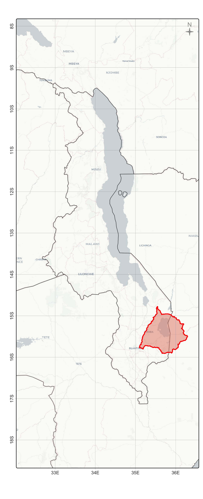

```{r setup, include=FALSE}
options(htmltools.dir.version = FALSE, htmltools.preserve.raw = FALSE)
knitr::opts_chunk$set(
  echo = TRUE, message = FALSE, warning = FALSE,
  error = FALSE, comment = NA, tidy.opts = list(width.cutoff = 6)
) 

requirements = c(
  "pacman", "easypackages")

setup <- function(requirements){
  missing.packages <- requirements[!(requirements %in% installed.packages()[,"Package"])];
  if(length(missing.packages)) {install.packages(
    missing.packages, repos = "https://cloud.r-project.org/"); }
  for(package_name in requirements){library(
    package_name,character.only=TRUE,quietly=TRUE);
  }
}

setup(requirements)

#pacman::p_load(
easypackages::packages(  
  "aws.s3", 
  "caret", "cli", "cols4all", "covr", "cowplot",
  "dendextend", "digest","DiagrammeR","dtwclust", 
  "e1071", "exactextractr", 
  "FNN", "future",
  "gdalcubes", "gdalUtilities", "geojsonsf","ggplot2","ggspatial",
  "hdf5r", "httr", "httr2",
  "jsonlite", 
  "kohonen", 
  "leafem", "libgeos","luz",
  "mapedit", "mapview", "maptiles", "methods","mgcv", 
  "ncdf4", "nnet", 
  "openxlsx", 
  "parallel",
  "randomForest", "rasterVis", "raster", "Rcpp", "RcppArmadillo", "RcppCensSpatial", 
  "RcppEigen", "RcppParallel", "RColorBrewer", "rsconnect","RStoolbox", "rts", 
  "sf", "scales", "sits","spdep", "stars", "stringr","supercells", 
  "terra", "testthat", "tidyverse","tools", "tmap", "tmaptools",
  "xgboost", "grid", "mapinsetr"
)
```

## AOIs & BBOXs

Derive `aoi` & `bbox` objects at preferred scales from site polygons & open source datasets.

```{r load-aoi, message=F, warning=F, error=F, comment=F}
aoi_site   = sf::read_sf("./inputs/chilwa_watershed_4326.shp")
aoi_malawi = giscoR::gisco_get_countries(country = "Malawi", resolution = "3")
aoi_malawi_vect  = vect(aoi_malawi)
aoi_region = giscoR::gisco_get_countries(
  country = c("Malawi", "Zambia", "Tanzania", "Mozambique"), resolution = "3"
  )

bbox_site  = terrainr::add_bbox_buffer(aoi_site, 20000, "meters")
vbox_malawi = terra::vect(terra::ext(vect(aoi_malawi)) * 1.6) 
crs(vbox_malawi) = "epsg:4326"
bbox_malawi = st_bbox(vbox_malawi)
```

## Site Map

We source higher-res basemaps from `maptiles` using `get_tiles` functions

```{r site_basemap, message=F, warning=F, error=F, comment=F, eval=F}
# 'zoom' = 12 scales to 1:70,000 (https://wiki.openstreetmap.org/wiki/Zoom_levels)
basemap_150k = maptiles::get_tiles(
  bbox_site, 
  zoom      = 12, 
  crop      = T,
  provider  = "OpenTopoMap"
)

tmap::tm_shape(basemap_150k) + tm_rgb() + 
  tmap::tm_shape(aoi_site) +
  tmap::tm_borders(lwd = 1, col = "red") +
  tmap::tm_graticules(lines=T,labels.rot=c(0,90),lwd=0.2) +
  tmap::tm_credits("EPSG:4326", position = c("left", "bottom")) + 
  tmap::tm_scalebar(c(0, 10, 20, 40), position = c("right", "bottom"), text.size = .5) +
  tmap::tm_compass(
    type = "4star", size = 1.5,
    color.dark = "gray60", text.color = "gray60",
    position = c("left", "top")
    ) -> map_locator_site
map_locator_site

# width & height controls resolution of output, dpi affects 'attributes' sizes
tmap::tmap_save(
  map_locator_site, "./outputs/map_locator_site.png", 
  width=15120, height=15120, asp=0, dpi=2400
  )
```


## Locator Map

```{r country_basemap, message=F, warning=F, error=F, comment=F, eval=F}
# zoom = 8 sources basemap at scale of 1:2,000,000
basemap_4m = maptiles::get_tiles(
  vbox_malawi, 
  zoom      = 8, 
  crop      = T,
  provider  = "CartoDB.Positron"
)

tmap::tm_shape(basemap_4m) + tm_rgb(alpha=0.2) + 
  tmap::tm_shape(aoi_region) +
  tmap::tm_borders(lwd = 0.4, col = "black") +
  tmap::tm_shape(aoi_site) +
  tmap::tm_borders(lwd = 2, col = "red", fill="#e28672", fill_alpha=0.5) +
  tmap::tm_compass(
    type = "4star", size = 1,
    color.dark = "gray60", text.color = "gray60",
    position = c("RIGHT", "TOP")
    ) -> map_locator_country
map_locator_country

tmap::tmap_save(map_locator_country, "./outputs/map_locator_country.png")
```



## Inset Map

```{r inset_basemap, message=F, warning=F, error=F, comment=F, eval=F}
main_map = tmap::tmap_grob(map_locator_site)
inset_map = tmap::tmap_grob(map_locator_country)

map_locator_inset = ggdraw() +
  draw_plot(main_map) +
  draw_plot(inset_map, x = -0.39, y=0.2, height = 0.70)
map_locator_inset

ggsave("./outputs/map_locator_inset.png", map_locator_inset)
#plot_grid(inset_map,main_map,nrow=1)
```


## Population Map

```{r population_map, message=F, warning=F, error=F, comment=F, eval=F}
# best download available in 1x1km raster format (person/km^2)
url1 <- "https://jeodpp.jrc.ec.europa.eu/ftp/jrc-opendata/GHSL/GHS_POP_GLOBE_R2023A/GHS_POP_E2025_GLOBE_R2023A_54009_1000/V1-0/GHS_POP_E2025_GLOBE_R2023A_54009_1000_V1_0.zip"
url2 <- "https://data.hydrosheds.org/file/hydrosheds-v1-msk/hyd_glo_msk_15s.zip"
#download.file(url = url, path = getwd(), destfile = file_name)
pop <- terra::rast("/Users/seamus/Repos/datasets/population/GHS_POP_E2030_GLOBE_R2023A_54009_1000_V1_0/GHS_POP_E2030_GLOBE_R2023A_54009_1000_V1_0.tif") 
mask = terra::rast('~/Repos/datasets/hydrography/hyd_glo_msk_15s/hyd_glo_msk_15s.tif')

# reproject to fix NAs found in output, long processing time
pop <- terra::project(pop, crs(aoi_malawi_vect))
pop = terra::crop(pop, aoi_malawi_vect, snap = "in", mask = T)
#mask <- terra::project(mask, crs(pop))
#mask = terra::resample(mask, pop)
#mask = terra::crop(mask, aoi_malawi_vect, snap = "in", mask = T)
# alternatively project from sf to rast :: 
# aoi_malawi = st_transform(aoi_malawi, st_crs(pop))
#pop = mask(pop, mask, inverse = TRUE)
names(pop)[1] <- "density_km" # number of persons per sq kilometer

aoi_malawi = st_transform(aoi_malawi, st_crs(pop))

tmap::tm_shape(aoi_malawi) +
  tmap::tm_borders(lwd=0) +
  tmap::tm_shape(pop) +
  tm_raster(
    style    = "fixed", 
    alpha    = 1, 
    palette  = "OrRd", 
    title    = "People/Km^2", 
    breaks   = c(0 , 0.01, 10, 100, 200, 1000, 2000, 50000)
    ) + 
  tmap::tm_shape(aoi_region) +
  tmap::tm_borders(lwd = 0.5, col = "black") +
  tmap::tm_shape(aoi_site) +
  tmap::tm_borders(lwd = 1, col = "darkgray", fill_alpha=0.5) +
  tmap::tm_compass(
    type       = "4star", 
    size       = 1,
    color.dark = "gray60", 
    text.color = "gray60",
    position   = c("RIGHT", "TOP")
  ) +
  tm_layout(
    main.title      = "Population Density", 
    title.size      = 1, 
    title.position  = c("LEFT", "top"), 
    legend.outside  = FALSE, 
    legend.position = c("right", "bottom")) + 
    tmap::tm_graticules(lines=T,labels.rot=c(0,90),lwd=0.2) +
  tmap::tm_credits("EPSG:4326", position = c("left", "bottom")) + 
  tmap::tm_scalebar(c(0, 50, 100, 200), position = c("LEFT", "BOTTOM"), text.size = .5) -> map_population

tmap::tmap_save(
  map_population, "./outputs/map_population.png", 
  width=15120, height=15120, asp=0, dpi=2400
  )  
```


## Watershed Map

