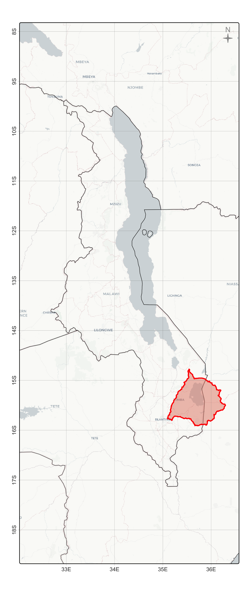

## AOIs & BBOXs

Derive `aoi` & `bbox` objects at preferred scales from site polygons & open source datasets.


``` r
aoi_site   = sf::read_sf("./inputs/chilwa_watershed_4326.shp")
aoi_malawi = giscoR::gisco_get_countries(country = "Malawi", resolution = "3")
aoi_malawi_vect  = vect(aoi_malawi)
aoi_region = giscoR::gisco_get_countries(
  country = c("Malawi", "Zambia", "Tanzania", "Mozambique"), resolution = "3"
  )

bbox_site  = terrainr::add_bbox_buffer(aoi_site, 20000, "meters")
vbox_malawi = terra::vect(terra::ext(vect(aoi_malawi)) * 1.6) 
crs(vbox_malawi) = "epsg:4326"
bbox_malawi = st_bbox(vbox_malawi)
```

## Site Map

We source higher-res basemaps from `maptiles` using `get_tiles` functions


``` r
# 'zoom' = 12 scales to 1:70,000 (https://wiki.openstreetmap.org/wiki/Zoom_levels)
basemap_150k = maptiles::get_tiles(
  bbox_site, 
  zoom      = 12, 
  crop      = T,
  provider  = "OpenTopoMap"
)

tmap::tm_shape(basemap_150k) + tm_rgb() + 
  tmap::tm_shape(aoi_site) +
  tmap::tm_borders(lwd = 1, col = "red") +
  tmap::tm_graticules(lines=T,labels.rot=c(0,90),lwd=0.2) +
  tmap::tm_credits("EPSG:4326", position = c("left", "bottom")) + 
  tmap::tm_scalebar(c(0, 10, 20, 40), position = c("right", "bottom"), text.size = .5) +
  tmap::tm_compass(
    type = "4star", size = 1.5,
    color.dark = "gray60", text.color = "gray60",
    position = c("left", "top")
    ) -> map_locator_site
map_locator_site

# width & height controls resolution of output, dpi affects 'attributes' sizes
tmap::tmap_save(
  map_locator_site, "./outputs/map_locator_site.png", 
  width=15120, height=15120, asp=0, dpi=2400
  )
```


## Locator Map


``` r
# zoom = 8 sources basemap at scale of 1:2,000,000
basemap_4m = maptiles::get_tiles(
  vbox_malawi, 
  zoom      = 8, 
  crop      = T,
  provider  = "CartoDB.Positron"
)

tmap::tm_shape(basemap_4m) + tm_rgb(alpha=0.2) + 
  tmap::tm_shape(aoi_region) +
  tmap::tm_borders(lwd = 0.4, col = "black") +
  tmap::tm_shape(aoi_site) +
  tmap::tm_borders(lwd = 2, col = "red", fill="#e28672", fill_alpha=0.5) +
  tmap::tm_compass(
    type = "4star", size = 1,
    color.dark = "gray60", text.color = "gray60",
    position = c("RIGHT", "TOP")
    ) -> map_locator_country
map_locator_country

tmap::tmap_save(map_locator_country, "./outputs/map_locator_country.png")
```



## Inset Map


``` r
main_map = tmap::tmap_grob(map_locator_site)
inset_map = tmap::tmap_grob(map_locator_country)

map_locator_inset = ggdraw() +
  draw_plot(main_map) +
  draw_plot(inset_map, x = -0.39, y=0.2, height = 0.70)
map_locator_inset

ggsave("./outputs/map_locator_inset.png", map_locator_inset)
#plot_grid(inset_map,main_map,nrow=1)
```


## Population Map


``` r
# best download available in 1x1km raster format (person/km^2)
url1 <- "https://jeodpp.jrc.ec.europa.eu/ftp/jrc-opendata/GHSL/GHS_POP_GLOBE_R2023A/GHS_POP_E2025_GLOBE_R2023A_54009_1000/V1-0/GHS_POP_E2025_GLOBE_R2023A_54009_1000_V1_0.zip"
url2 <- "https://data.hydrosheds.org/file/hydrosheds-v1-msk/hyd_glo_msk_15s.zip"
#download.file(url = url, path = getwd(), destfile = file_name)
pop <- terra::rast("/Users/seamus/Repos/datasets/population/GHS_POP_E2030_GLOBE_R2023A_54009_1000_V1_0/GHS_POP_E2030_GLOBE_R2023A_54009_1000_V1_0.tif") 
mask = terra::rast('~/Repos/datasets/hydrography/hyd_glo_msk_15s/hyd_glo_msk_15s.tif')

# reproject to fix NAs found in output, long processing time
pop <- terra::project(pop, crs(aoi_malawi_vect))
pop = terra::crop(pop, aoi_malawi_vect, snap = "in", mask = T)
#mask <- terra::project(mask, crs(pop))
#mask = terra::resample(mask, pop)
#mask = terra::crop(mask, aoi_malawi_vect, snap = "in", mask = T)
# alternatively project from sf to rast :: 
# aoi_malawi = st_transform(aoi_malawi, st_crs(pop))
#pop = mask(pop, mask, inverse = TRUE)
names(pop)[1] <- "density_km" # number of persons per sq kilometer

aoi_malawi = st_transform(aoi_malawi, st_crs(pop))

tmap::tm_shape(aoi_malawi) +
  tmap::tm_borders(lwd=0) +
  tmap::tm_shape(pop) +
  tm_raster(
    style    = "fixed", 
    alpha    = 1, 
    palette  = "OrRd", 
    title    = "People/Km^2", 
    breaks   = c(0 , 0.01, 10, 100, 200, 1000, 2000, 50000)
    ) + 
  tmap::tm_shape(aoi_region) +
  tmap::tm_borders(lwd = 0.5, col = "black") +
  tmap::tm_shape(aoi_site) +
  tmap::tm_borders(lwd = 1, col = "darkgray", fill_alpha=0.5) +
  tmap::tm_compass(
    type       = "4star", 
    size       = 1,
    color.dark = "gray60", 
    text.color = "gray60",
    position   = c("RIGHT", "TOP")
  ) +
  tm_layout(
    main.title      = "Population Density", 
    title.size      = 1, 
    title.position  = c("LEFT", "top"), 
    legend.outside  = FALSE, 
    legend.position = c("right", "bottom")) + 
    tmap::tm_graticules(lines=T,labels.rot=c(0,90),lwd=0.2) +
  tmap::tm_credits("EPSG:4326", position = c("left", "bottom")) + 
  tmap::tm_scalebar(c(0, 50, 100, 200), position = c("LEFT", "BOTTOM"), text.size = .5) -> map_population

tmap::tmap_save(
  map_population, "./outputs/map_population.png", 
  width=15120, height=15120, asp=0, dpi=2400
  )  
```


## Watershed Map

